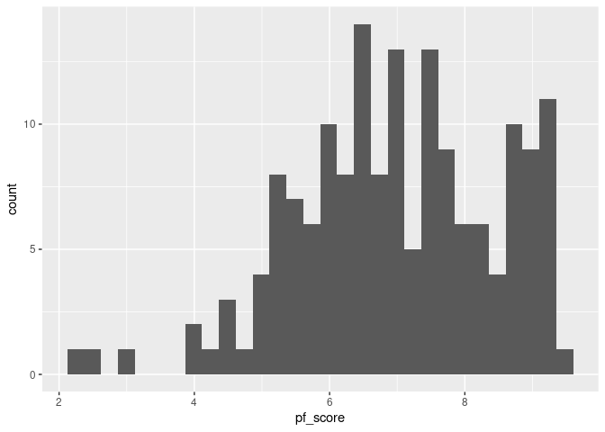
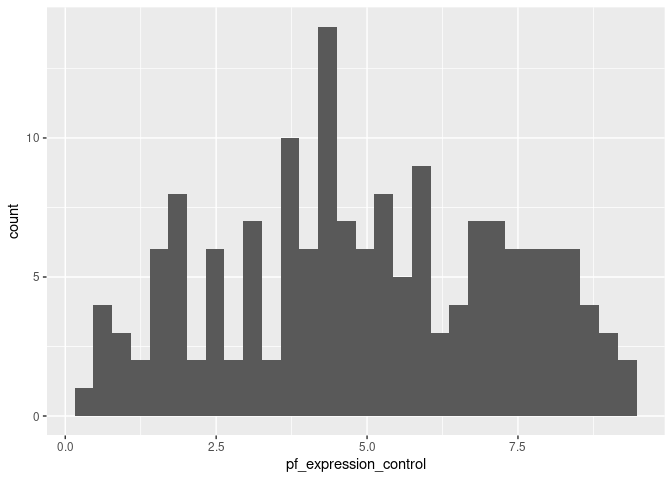
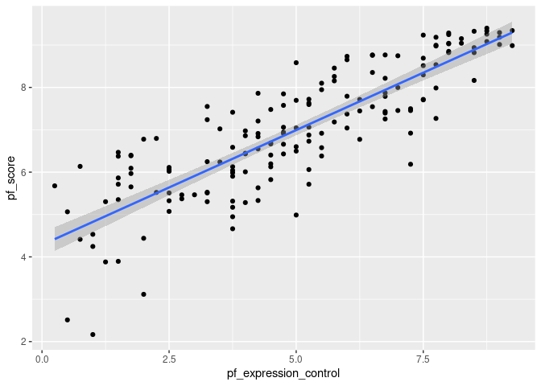
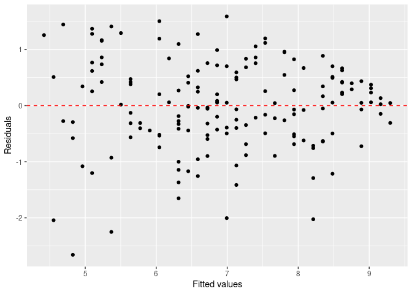
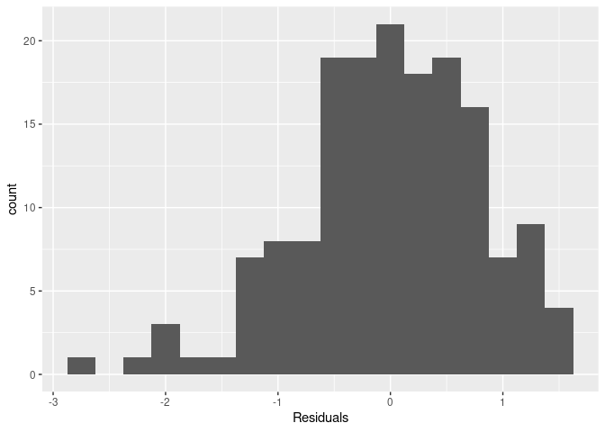

Simple Linear Regression Analysis
================

`{global-options, include=FALSE} knitr::opts_chunk$set(echo = TRUE)`

## Introduction

This will likely be the only `.Rmd` file that I provide to you as all
other activities will have you follow directions in the day-specific
folder’s `README` and type your own “report” in an Rmarkdown document
that you create. Note that when I type in Rmarkdown files, each sentence
begins on its own line. This helps me to quickly find errors and correct
them, but you do not need to use this method.

If I want to start a new paragraph, I simply press Enter/Return twice to
create a new “block”. Below is an R code chunk named
“simple-calculations”. When I am working in Rmarkdown documents, I make
sure that every code chunk has a descriptive title. This is a suggestion
that I strongly recommend that you follow. We will see how naming code
chunks makes our life easier later in this document so be sure to stick
around.

``` r
# Practicing addition
2 + 5
```

    ## [1] 7

``` r
# Creating an integer vector with values 1 through 9
int_vect <- c(1:9)
int_vect
```

    ## [1] 1 2 3 4 5 6 7 8 9

``` r
# creating a character vector with letters a through q
char_vect <- letters[1:17]
char_vect
```

    ##  [1] "a" "b" "c" "d" "e" "f" "g" "h" "i" "j" "k" "l" "m" "n" "o" "p" "q"

``` r
# The number of letters occurring after d through q
length(char_vect) - 4
```

    ## [1] 13

In the code chunk named “simple-calculations”, add the R code that does
the following:

1.  Adds the values 2 and 5.
2.  Creates an R object called `int_vect` that contains the values 1
    through 9 - can you do this without typing each number?.
3.  Creates an R objected called `char_vect` that contains the letters
    “A” (the first letter of the alphabet) through “Q” (the 17th letter
    of the alphabet) - can you do this without typing each letter?
4.  Using code, determine how many of the items in `char_vect` occur
    after the letter “D”
5.  Provides a descriptive comment for each of the above tasks.
6.  Run each line to verify that you get the results you would expect,
    then click on the **knit**
    
    icon your Rmd document to verify that no errors occur. If you use
    [keyboard
    shortcuts](https://support.posit.co/hc/en-us/articles/200711853-Keyboard-Shortcuts-in-the-RStudio-IDE),
    like me, you can instead press Ctrl + Shift + K (for mac users:
    Cmd + Shift + K).
7.  Return to the **Day 3** `README` file to finish the process of
    committing and pushing to GitHub.

Do not proceed in this document until you have finished the directions
in the **Day 3** `README` file.

## A typical modeling process

The process that we will use for today’s activity is:

1.  Identify our research question(s),
2.  Explore (graphically and with numerical summaries) the variables of
    interest - both individually and in relationship to one another,
3.  Fit a simple linear regression model to obtain and describe model
    estimates,
4.  Assess how “good” our model is, and
5.  Predict new values.

We will continue to update/tweak/adapt this process and you are
encouraged to build your own process. Before we begin, we set up our R
session and introduce this activity’s data.

### The setup

We will be using two packages from Posit (formerly
[RStudio](https://posit.co/)): `{tidyverse}` and `{tidymodels}`. If you
would like to try the *ISLR* labs using these two packages instead of
base R, [Emil Hvitfeldt](https://www.emilhvitfeldt.com/) (of Posit) has
put together a [complementary online
text](https://emilhvitfeldt.github.io/ISLR-tidymodels-labs/index.html).

-   In the **Packages** pane of RStudio (same area as **Files**), check
    to see if `{tidyverse}` and `{tidymodels}` are installed. Be sure to
    check both your **User Library** and **System Library**.

-   If either of these are not currently listed, type the following in
    your **Console** pane, replacing `package_name` with the appropriate
    name, and press Enter/Return afterwards.

    ``` r
    # Note: the "eval = FALSE" in the above line tells R not to evaluate this code
    install.packages("package_name")
    ```

-   Once you have verified that both `{tidyverse}` and `{tidymodels}`
    are installed, load these packages in the R chunk below titled
    `setup`. That is, type the following:

    ``` r
    library(tidyverse)
    library(tidymodels)
    ```

-   Run the `setup` code chunk and/or **knit**
    
    icon your Rmd document to verify that no errors occur.

``` r
library(tidyverse)
```

    ## ── Attaching core tidyverse packages ──────────────────────── tidyverse 2.0.0 ──
    ## ✔ dplyr     1.1.2     ✔ readr     2.1.4
    ## ✔ forcats   1.0.0     ✔ stringr   1.5.0
    ## ✔ ggplot2   3.4.2     ✔ tibble    3.2.1
    ## ✔ lubridate 1.9.2     ✔ tidyr     1.3.0
    ## ✔ purrr     1.0.1     
    ## ── Conflicts ────────────────────────────────────────── tidyverse_conflicts() ──
    ## ✖ dplyr::filter() masks stats::filter()
    ## ✖ dplyr::lag()    masks stats::lag()
    ## ℹ Use the conflicted package (<http://conflicted.r-lib.org/>) to force all conflicts to become errors

``` r
library(tidymodels)
```

    ## ── Attaching packages ────────────────────────────────────── tidymodels 1.0.0 ──
    ## ✔ broom        1.0.4     ✔ rsample      1.1.0
    ## ✔ dials        1.0.0     ✔ tune         1.0.0
    ## ✔ infer        1.0.3     ✔ workflows    1.0.0
    ## ✔ modeldata    1.0.0     ✔ workflowsets 1.0.0
    ## ✔ parsnip      1.0.1     ✔ yardstick    1.0.0
    ## ✔ recipes      1.0.1     
    ## ── Conflicts ───────────────────────────────────────── tidymodels_conflicts() ──
    ## ✖ scales::discard() masks purrr::discard()
    ## ✖ dplyr::filter()   masks stats::filter()
    ## ✖ recipes::fixed()  masks stringr::fixed()
    ## ✖ dplyr::lag()      masks stats::lag()
    ## ✖ yardstick::spec() masks readr::spec()
    ## ✖ recipes::step()   masks stats::step()
    ## • Learn how to get started at https://www.tidymodels.org/start/

 **Check in**

Test your GitHub skills by staging, committing, and pushing your changes
to GitHub and verify that your changes have been added to your GitHub
repository.

### The data

The data we’re working with is from the OpenIntro site:
`https://www.openintro.org/data/csv/hfi.csv`. Here is the “about” page:
<https://www.openintro.org/data/index.php?data=hfi>.

In the R code chunk below titled `load-data`, you will type the code
that reads in the above linked CSV file by doing the following:

-   Rather than downloading this file, uploading to RStudio, then
    reading it in, explore how to load this file directly from the
    provided URL with `readr::read_csv` (`{readr}` is part of
    `{tidyverse}`).
-   Assign this data set into a data frame named `hfi` (short for “Human
    Freedom Index”).

``` r
hfi <- readr::read_csv('https://www.openintro.org/data/csv/hfi.csv')
```

    ## Rows: 1458 Columns: 123
    ## ── Column specification ────────────────────────────────────────────────────────
    ## Delimiter: ","
    ## chr   (3): ISO_code, countries, region
    ## dbl (120): year, pf_rol_procedural, pf_rol_civil, pf_rol_criminal, pf_rol, p...
    ## 
    ## ℹ Use `spec()` to retrieve the full column specification for this data.
    ## ℹ Specify the column types or set `show_col_types = FALSE` to quiet this message.

After doing this and viewing the loaded data, answer the following
questions:

1.  What are the dimensions of the dataset? What does each row
    represent?

**Answer:** There are 123 dimensions and each row represents a country.

The dataset spans a lot of years. We are only interested in data from
year 2016. In the R code chunk below titled `hfi-2016`, type the code
that does the following:

-   Filter the data `hfi` data frame for year 2016, and
-   Assigns the result to a data frame named `hfi_2016`.

``` r
hfi_2016 <- hfi %>% 
  filter(year == 2016)
```

### 1. Identify our research question(s)

The research question is often defined by you (or your company, boss,
etc.). Today’s research question/goal is to predict a country’s personal
freedom score in 2016.

For this activity we want to explore the relationship between the
personal freedom score, `pf_score`, and the political pressures and
controls on media content index,`pf_expression_control`. Specifically,
we are going to use the political pressures and controls on media
content index to predict a country’s personal freedom score in 2016.

### 2. Explore the variables of interest

Answer the following questions (use your markdown skills) and complete
the following tasks.

2.  What type of plot would you use to display the distribution of the
    personal freedom scores, `pf_score`? Would this be the same type of
    plot to display the distribution of the political pressures and
    controls on media content index, `pf_expression_control`?

**Answer:** To check the distribution of `pf_score`, I would use a
histogram. I would also use a histogram to look at the distribution of
`pf_expression_control`.

-   In the R code chunk below titled `univariable-plots`, type the R
    code that displays this plot for `pf_score`.
-   In the R code chunk below titled `univariable-plots`, type the R
    code that displays this plot for `pf_expression_control`.

``` r
q2 <- ggplot(data = hfi_2016)

q2 + geom_histogram(aes(x = pf_score))
```

    ## `stat_bin()` using `bins = 30`. Pick better value with `binwidth`.

<!-- -->

``` r
q2 + geom_histogram(aes(x = pf_expression_control))
```

    ## `stat_bin()` using `bins = 30`. Pick better value with `binwidth`.

<!-- -->

4.  Comment on each of these two distributions. Be sure to describe
    their centers, spread, shape, and any potential outliers.

**Answer:** Looking at the histogram for `pf_score`, we can see that
there is a slight skew to the left. There are potential outliers in the
left tail where `pf_score` is between 2 and 3 and then one around 9.5.
The center/peak of the data is at approximately 6.5. It is Spread
between values 2 and 10.

Looking at the histogram for `pf_expression_control`, the data
distribution appears to be approximately normal. The center/median of
the data appears to be around 4 while it is spread between 0 and 8.

3.  What type of plot would you use to display the relationship between
    the personal freedom score, `pf_score`, and the political pressures
    and controls on media content index,`pf_expression_control`?

**Answer**: I would use a scatterplot to display the relationship
between `pf_score` and `pf_expression_control`.

-   In the R code chunk below titled `relationship-plot`, plot this
    relationship using the variable `pf_expression_control` as the
    predictor/explanatory variable.

``` r
q2 +
geom_point(aes(x = pf_expression_control, y = pf_score))
```

<!-- -->

4.  Does the relationship look linear? If you knew a country’s
    `pf_expression_control`, or its score out of 10, with 0 being the
    most, of political pressures and controls on media content, would
    you be comfortable using a linear model to predict the personal
    freedom score?

**Answer:** The relationship in the above scatterplot does look linear.
If I recall correctly, certain conditions (normality,
heteroscedasticity) need to be met before we can attempt a linear
regression model.

#### Challenge

For each plot and using your `{dplyr}` skills, obtain the appropriate
numerical summary statistics and provide more detailed descriptions of
these plots. For example, in (4) you were asked to comment on the
center, spread, shape, and potential outliers. What measures
could/should be used to describe these? You might not know of one for
each of those terms.

What numerical summary would you use to describe the relationship
between two numerical variables? (hint: explore the `cor` function from
Base R)

``` r
hfi_2016 %>% 
  select(pf_score) %>% 
  summarise(mean = mean(pf_score), 
            median = median(pf_score), 
            sd = sd(pf_score), 
            min = min(pf_score), 
            max = max(pf_score))
```

    ## # A tibble: 1 × 5
    ##    mean median    sd   min   max
    ##   <dbl>  <dbl> <dbl> <dbl> <dbl>
    ## 1  6.98   6.93  1.49  2.17  9.40

``` r
hfi_2016 %>% 
  select(pf_expression_control) %>% 
  summarise(mean = mean(pf_expression_control), 
            median = median(pf_expression_control), 
            sd = sd(pf_expression_control), 
            min = min(pf_expression_control), 
            max = max(pf_expression_control))
```

    ## # A tibble: 1 × 5
    ##    mean median    sd   min   max
    ##   <dbl>  <dbl> <dbl> <dbl> <dbl>
    ## 1  4.98      5  2.32  0.25  9.25

``` r
cor(hfi_2016$pf_score, hfi_2016$pf_expression_control)
```

    ## [1] 0.8450646

**More detailed descriptions:** Looking at the descriptive statistics
for `pf_score`, we can see that there is a mean of 6.98 and a median of
6.93, which confirms a normal distribution. The standard deviation is
1.49, meaning that this is the typical distance between each data point
and the mean. The min and max values tell us that the data falls between
the values 2.17 and 9.4.

Looking at the descriptive statistics for `pf_expression_control`, we
can see that the mean (4.98) and median (5) are almost the same, which
again supports a normal distribution. The SD is 2.32, so the data does
not cluster as close to the mean as they did for `pf_score`, and it is
also more spread out with a min of 0.25 and max of 9.25.

### 3. Fit a simple linear regression model

Regardless of your response to (4), we will continue fitting a simple
linear regression (SLR) model to these data. The code that we will be
using to fit statistical models in this course use `{tidymodels}` - an
opinionated way to fit models in R - and this is likely new to most of
you. I will provide you with example code when I do not think you should
know what to do - i.e., anything `{tidymodels}` related.

To begin, we will create a `{parsnip}` specification for a linear model.

-   In the code chunk below titled `parsnip-spec`, replace “verbatim”
    with “r” just before the code chunk title.

``` r
lm_spec <- linear_reg() %>%
  set_mode("regression") %>%
  set_engine("lm")

lm_spec
```

    ## Linear Regression Model Specification (regression)
    ## 
    ## Computational engine: lm

Note that the `set_mode("regression")` is really unnecessary/redundant
as linear models (`"lm"`) can only be regression models. It is better to
be explicit as we get comfortable with this new process. Remember that
you can type `?function_name` in the R **Console** to explore a
function’s help documentation.

The above code also outputs the `lm_spec` output. This code does not do
any calculations by itself, but rather specifies what we plan to do.

Using this specification, we can now fit our model:
$\texttt{pf\score} = \beta_0 + \beta_1 \times \texttt{pf\_expression\_control} + \varepsilon$.
Note, the “\$” portion in the previous sentence is LaTeX snytex which is
a math scripting (and other scripting) language. I do not expect you to
know this, but you will become more comfortable with this. Look at your
knitted document to see how this syntax appears.

-   In the code chunk below titled `fit-lm`, replace “verbatim” with “r”
    just before the code chunk title.

``` r
slr_mod <- lm_spec %>% 
  fit(pf_score ~ pf_expression_control, data = hfi_2016)

tidy(slr_mod)
```

    ## # A tibble: 2 × 5
    ##   term                  estimate std.error statistic  p.value
    ##   <chr>                    <dbl>     <dbl>     <dbl>    <dbl>
    ## 1 (Intercept)              4.28     0.149       28.8 4.23e-65
    ## 2 pf_expression_control    0.542    0.0271      20.0 2.31e-45

The above code fits our SLR model, then provides a `tidy` parameter
estimates table.

5.  Using the `tidy` output, update the below formula with the estimated
    parameters. That is, replace “intercept” and “slope” with the
    appropriate values

$\hat{\texttt{pf\score}} = 4.28 + 0.54 \times \texttt{pf\_expression\_control}$

6.  Interpret each of the estimated parameters from (5) in the context
    of this research question. That is, what do these values represent?

**Answer:** When `pf_expression_control` equals 0, we can expect
`pf_score` to equal 4.28.

For every 1 unit increase in `pf_expression_control`, we can expect
`pf_score` to increase 0.54 units.

### 4. Assess our model

Hopefully, you were able to interpret the SLR model parameter estimates
(i.e., the *y*-intercept and slope) as follows:

> For countries with a `pf_expression_control` of 0 (those with the
> largest amount of political pressure on media content), we expect
> their mean personal freedom score to be 4.28.

> For every 1 unit increase in `pf_expression_control` (political
> pressure on media content index), we expect a country’s mean personal
> freedom score to increase 0.542 units.

To assess our model fit, we can use $R^2$ (the coefficient of
determination), the proportion of variability in the response variable
that is explained by the explanatory variable. We use `glance` from
`{broom}` (which is automatically loaded with `{tidymodels}` - `{broom}`
is also where `tidy` is from) to access this information.

-   In the code chunk below titled `glance-lm`, replace “verbatim” with
    “r” just before the code chunk title.

``` r
glance(slr_mod)
```

    ## # A tibble: 1 × 12
    ##   r.squared adj.r.squared sigma statistic  p.value    df logLik   AIC   BIC
    ##       <dbl>         <dbl> <dbl>     <dbl>    <dbl> <dbl>  <dbl> <dbl> <dbl>
    ## 1     0.714         0.712 0.799      400. 2.31e-45     1  -193.  391.  400.
    ## # ℹ 3 more variables: deviance <dbl>, df.residual <int>, nobs <int>

After doing this and running the code, answer the following questions:

7.  What is the value of $R^2$ for this model?

**Answer:** $R^2$ = 0.71.

8.  What does this value mean in the context of this model? Think about
    what would a “good” value of $R^2$ would be? Can/should this value
    be “perfect”?

**Answer:** Putting our $R^2$ into context, we can say that
`pf_expression_control` accounts for 0.71 of the variability seen in
this model. In past classes, we got excited when $R^2$ got to be around
0.8 (with 0.75 being acceptable). However, considering this is a simple
linear regression model, 0.71 seems respectable. We should not aim for a
perfect $R^2$! Adding more variables to the model tends to artificially
increase this value. We also run the risk of overfitting.

### 5. Predict

Before we start predicting, you will first create a scatterplot with the
least squares line for `slr_mod` laid on top of the points.

-   Copy-and-paste the *entire* code chunk of the scatterplot you
    created in (3) below the last bullet in this series (there is extra
    space here). Want to get there quickly? In the bottom left-hand
    corner of the **Rmd** file pane you should see something like “\# 5.
    Predict”, where the “\#” is an orange icon. Clicking on that you can
    navigate to the code chunk titled `relationship-plot` (Chunk 6),
    then click back on “5. Predict” to travel back here.
-   Update this code chunk’s name to be `lm-line` (otherwise errors will
    occur when you knit).
-   Next, add a layer to this (remember how `{ggplot2}` represents
    adding various data layers to plots) that shows a *smooth* line
    *geometry* (hint: explore `geom_smooth`).
-   In this *smooth* line *geometry* layer, be sure to specify the
    `method` as `"lm"` and do **not** display confidence intervals
    around your bands (hint: look at the help documentation for the
    `geom_smooth` layer).

``` r
ggplot(data = hfi_2016, aes(x = pf_expression_control, y = pf_score)) +
  geom_point() +
  geom_smooth(method = lm)
```

    ## `geom_smooth()` using formula = 'y ~ x'

<!-- -->

This line can be used to predict $y$ at any value of $x$. When
predictions are made for values of $x$ that are beyond the range of the
observed data, it is referred to as *extrapolation* and is not usually
recommended. However, predictions made within the range of the data are
more reliable. They’re also used to compute the residuals.

Answer the following question:

9.  If someone saw the least squares regression line from (5) and not
    the actual data, how would they predict a country’s personal freedom
    school when their `pf_expression_control` is an index of 3? What
    should they predict?

**Answer:** I imgain they would predict a `pf_score` of about 6.2 or
6.25 if the `pf_expression_control` is at an index of 3.

Now, we will check your math!

To do this, we need to specify the value(s) that we want to predict so
we will create a “predict” dataset that contains the value(s) that we
wish to predict. I create this in the code chunk below, but for each
index integer value.

``` r
pred_df <- tibble::tibble(
  pf_expression_control = 0:10
)
```

We can now use the `predict` function to obtain predictions for each of
these indices:

-   In the code chunk below titled `predict`, replace “verbatim” with
    “r” just before the code chunk title.

``` r
pred_df %>% 
  mutate(
    pred_value = predict(slr_mod, new_data = pred_df) %>% pull(.pred)
  )
```

    ## # A tibble: 11 × 2
    ##    pf_expression_control pred_value
    ##                    <int>      <dbl>
    ##  1                     0       4.28
    ##  2                     1       4.83
    ##  3                     2       5.37
    ##  4                     3       5.91
    ##  5                     4       6.45
    ##  6                     5       6.99
    ##  7                     6       7.53
    ##  8                     7       8.08
    ##  9                     8       8.62
    ## 10                     9       9.16
    ## 11                    10       9.70

Note that I am making it easier to see what our *x* value and
*predicted* values are. I encourage you to go through each line above
and describe what that line is doing.

10. How did your by-hand calculation go?

**Answer:** My by-hand calculation was a little bit high.

### Model diagnostics

To assess whether the linear model is reliable, we should check for (1)
linearity, (2) nearly normal residuals, and (3) constant variability.
Note that the normal residuals is not really necessary for all models
(sometimes we simply want to describe a relationship for the data that
we have or population-level data, where statistical inference is not
appropriate/necessary).

In order to do these checks we need access to the fitted (predicted)
values and the residuals. We can use `broom::augment` to calculate
these.

-   In the code chunk below titled `augment`, replace “verbatim” with
    “r” just before the code chunk title.

``` r
slr_aug <- augment(slr_mod, hfi_2016)

slr_aug
```

    ## # A tibble: 162 × 125
    ##     year ISO_code countries  region               pf_rol_procedural pf_rol_civil
    ##    <dbl> <chr>    <chr>      <chr>                            <dbl>        <dbl>
    ##  1  2016 ALB      Albania    Eastern Europe                    6.66         4.55
    ##  2  2016 DZA      Algeria    Middle East & North…             NA           NA   
    ##  3  2016 AGO      Angola     Sub-Saharan Africa               NA           NA   
    ##  4  2016 ARG      Argentina  Latin America & the…              7.10         5.79
    ##  5  2016 ARM      Armenia    Caucasus & Central …             NA           NA   
    ##  6  2016 AUS      Australia  Oceania                           8.44         7.53
    ##  7  2016 AUT      Austria    Western Europe                    8.97         7.87
    ##  8  2016 AZE      Azerbaijan Caucasus & Central …             NA           NA   
    ##  9  2016 BHS      Bahamas    Latin America & the…              6.93         6.01
    ## 10  2016 BHR      Bahrain    Middle East & North…             NA           NA   
    ## # ℹ 152 more rows
    ## # ℹ 119 more variables: pf_rol_criminal <dbl>, pf_rol <dbl>,
    ## #   pf_ss_homicide <dbl>, pf_ss_disappearances_disap <dbl>,
    ## #   pf_ss_disappearances_violent <dbl>, pf_ss_disappearances_organized <dbl>,
    ## #   pf_ss_disappearances_fatalities <dbl>, pf_ss_disappearances_injuries <dbl>,
    ## #   pf_ss_disappearances <dbl>, pf_ss_women_fgm <dbl>,
    ## #   pf_ss_women_missing <dbl>, pf_ss_women_inheritance_widows <dbl>, …

 **Check in**

Look at the various information produced by this code. Can you identify
what each column represents?

**Linearity**: You already checked if the relationship between
`pf_score` and `pf_expression_control` is linear using a scatterplot. We
should also verify this condition with a plot of the residuals
vs. fitted (predicted) values.

-   In the code chunk below titled `fitted-residual`, replace “verbatim”
    with “r” just before the code chunk title.

``` r
ggplot(data = slr_aug, aes(x = .pred, y = .resid)) +
  geom_point() +
  geom_hline(yintercept = 0, linetype = "dashed", color = "red") +
  xlab("Fitted values") +
  ylab("Residuals")
```

<!-- -->

Notice here that `slr_aug` can also serve as a data set because stored
within it are the fitted values ($\hat{y}$) and the residuals. Also note
that we are getting fancy with the code here. After creating the
scatterplot on the first layer (first line of code), we overlay a red
horizontal dashed line at $y = 0$ (to help us check whether the
residuals are distributed around 0), and we also rename the axis labels
to be more informative.

Answer the following question:

11. Is there any apparent pattern in the residuals plot? What does this
    indicate about the linearity of the relationship between the two
    variables?

**Nearly normal residuals**: To check this condition, we can look at a
histogram of the residuals.

-   In the code chunk below titled `residual-histogram`, replace
    “verbatim” with “r” just before the code chunk title.

``` r
ggplot(data = slr_aug, aes(x = .resid)) +
  geom_histogram(binwidth = 0.25) +
  xlab("Residuals")
```

<!-- -->

Answer the following question:

12. Based on the histogram, does the nearly normal residuals condition
    appear to be violated? Why or why not?

**Answer:** No, the nearly normal residuals condition does not appear to
be violated. There does appear to be a slight skew to the left, but the
criteria is “nearly normal”. So, all things considered, I think the
condition is met.

**Constant variability**:

13. Based on the residuals vs. fitted plot, does the constant
    variability condition appear to be violated? Why or why not?

**Answer:** The constant variability condidion appears to be met. There
is no dicernable shape in the residuals vs. fitted plot (snowstorm!).
